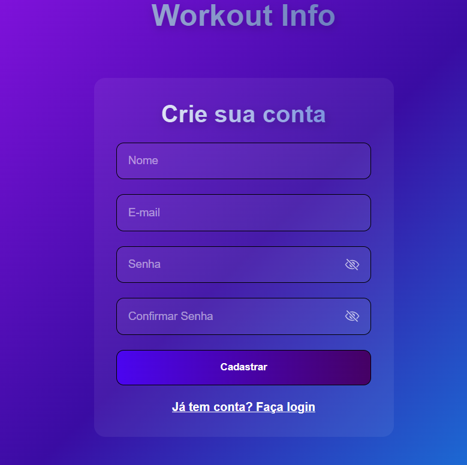
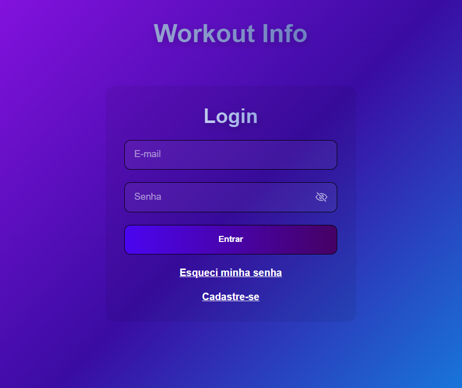
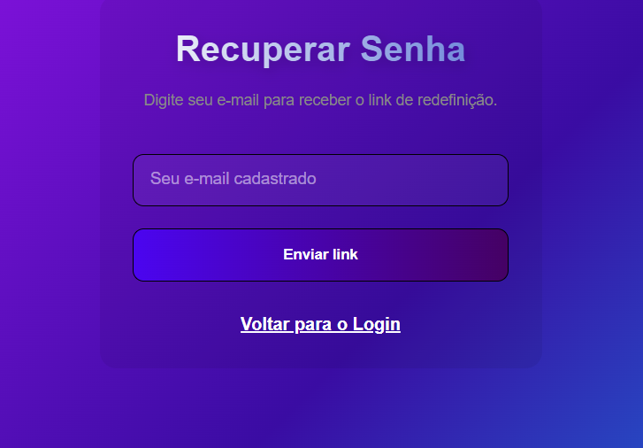

# Workout Info

> **Status do Projeto:** Finalizado / Em manutenção

Site de gestão de treinos para acompanhamento pessoal. Decidi criar um site "completo" com o esperado por mim de um site.
Fiz esse projeto principalmente para acompanhamento próprio.
Dito isso, o site apresenta as seguintes funcionalidades:

## Principais Funcionalidades

- **Lista de Treinos:** Possibilidade de adicionar, remover, editar treinos.
- **Calendário de Treinos:** Identificação visual dos dias de treino.
- **Acompanhamento de Evolução:** Widget de progressão de carga.
- **Sistema de Usuários:** Cadastro, Login ,Recuperação de senha com segurança JWT e persistência de sessão.

## Demonstração

### Dashboard Principal

  

### Tela de Criação de Conta

  

### Tela de Login

  

### Tela de Recuperação de Senha

  

## Como rodar o projeto

### Backend (Python)
1. Instale as dependências: `python -m pip install -r requirements.txt`
2. Configure seu arquivo `.env` com suas chaves.
3. Inicie a API: `uvicorn main:app --reload`

### Frontend (React)
1. Instale os pacotes: `npm install`
2. Rode o projeto: `npm run dev`

## Tecnologias

- **Backend:** FastAPI, SQLAlchemy, SQLite, Pydantic.
- **Frontend:** React.js, Vite, React Hot Toast e outras menos importantes.
